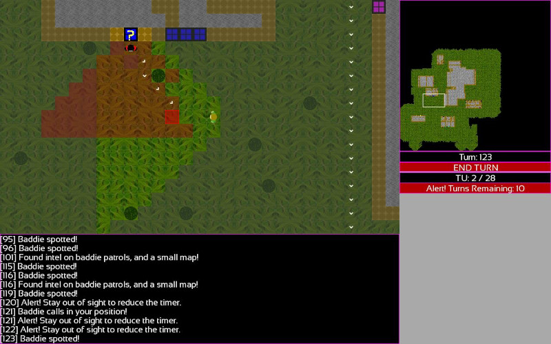

# BASE 34

**Version**: 0.0.2

**Description**: A "Tactical Espionage Roguelike" in which the player must infiltrate a location filled with guards that they must avoid, sneak around, or otherwise deal with while achieving objectives. Like a combination of Metal Gear Solid, Xenonauts, XCOM, and Invisible Inc, eventually. Still in the early conceptual stages. Engine based on several of my previous projects (in particular Blockade, Sector 34, and DUG3), and powered with pygame.

**Status / Progress**: A simple placeholder scenario for now in which the player can sneak around, avoid guards, find some terminals to unlock maps and patrol routes, and "win" by finding the MacGuffin terminal. Still very much a testing arena. The next few updates will include weapons, increasingly better AI, much more loot, a lot more interesting things hidden in the various nooks and crannies of the buildings, an inventory system, ranged and melee combat in which the player can do more than run away, and possibly controllable allies. Enjoy!

**System Requirements**: About 1.5gb of RAM, a python interpreter, a more or less recent version of the pygame library, and any reasonable computer build in the last 15 years (my own laptop is from, like, 2012 or something). Not tested on Windows yet.

**Pyinstaller Installation**: If one wishes to make an executable file using pyinstaller, then simply run `pyinstaller base34.spec` and the resulting single executable file can be found at `./dist/base34`.

