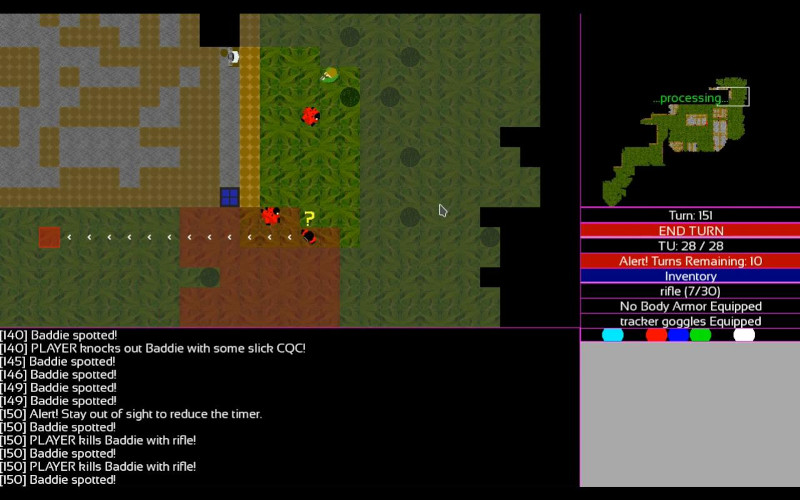

# BASE 34

 

**Version**: 0.0.4

**Description**: A "Tactical Espionage Roguelike" in which the player must infiltrate a location filled with guards that they must avoid, sneak around, or otherwise "deal with" while achieving objectives. Like a combination of Metal Gear Solid, Xenonauts, XCOM, and Invisible Inc, eventually. Still in the early conceptual stages. Engine based on several of my previous projects (in particular Blockade, Sector 34, and DUG3), and powered with pygame.

**Status / Progress**: 0.0.4 includes an overwatch system and some small improvements. Stay tuned for more feature updates in 0.0.5 and 0.0.6.

**System Requirements**: About 1.5gb of RAM, a python interpreter, a more or less recent version of the pygame library, and any reasonable computer build in the last 15 years (my own laptop is from, like, 2012 or something). Not tested on Windows yet.

**Pyinstaller Installation**: If one wishes to make an executable file using pyinstaller, then simply run `pyinstaller base34.spec` and the resulting single executable file can be found at `./dist/base34`.

