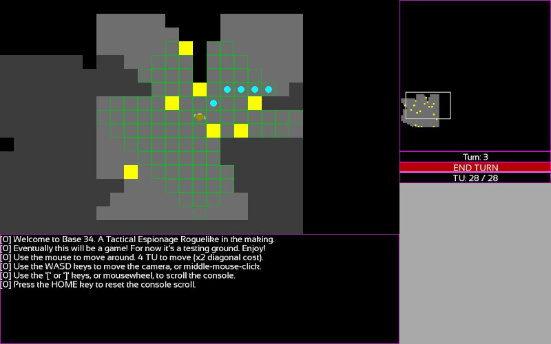

# BASE 34

**Version**: 0.0.0

**Description**: Built on several of my previous projects (in particular Sector 34, Blockade, and DUG3), I have decided to make a "Tactical Espionage Roguelike" in the vein of games like Metal Gear Solid, and Invisible Inc. Unlike many Roguelikes, I will be using a raw TU system more akin to Xenonauts or the original X-COM games, and the game handles like a one-person XCOM squad. The idea is to have a single large map which is densely backed and procedurally-generated, in which the player opens up new areas and new abilities, is encouraged to sneak around and backtrack, and experiences a complex interaction of procedurally generated events within this single map (again, with Metal Gear Solid in mind), as opposed to the progression through a dungeon's levels which is more common in a Roguelike. Essentially, the whole game will be the infiltration of "Base 34", and the goal is to have it be something that a good player can beat in just an hour or two, but with extreme variance from run to run in terms of layout, abilities, gear, enemies, and progression. Still in the early conceptual stages.

**Status / Progress**: Basic engine stuff for now, but will be implementing some better art and some gameplay systems soon. Basic engine skeleton is pretty much there, and the next steps are going to be gameplay-oriented.

